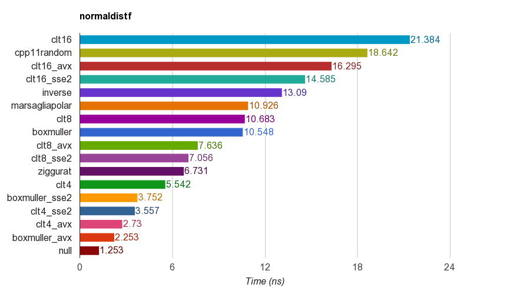
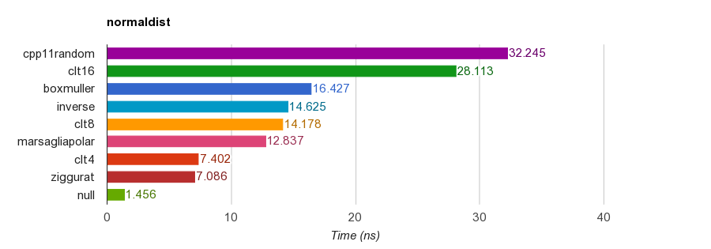

# Normally Distributed Random Number Generator Benchmark

Copyright(c) 2015 Milo Yip (miloyip@gmail.com)

## Introduction

This benchmark evaluates the performance of generting random numbers with standard normal distribution. The function prototypes are:

~~~~~~~~cpp
void normaldistf(float* data, size_t n);
void normaldist(double* data, size_t n);
~~~~~~~~

These functions generate `n` standard normal distributed random numbers (samples), in `float` and `double` respectively. 

Generating muliple random numbers, instead of generating a single random number, can be suitable for some algorithms (such as Box-Muller generates two numbers at once, and also SIMD versions).

Some implemenetations require `data` to be 16 or 32 byte aligned, and `n` to be multiples of 2, 8, 16, 32 etc.

## Procedure

Firstly the program verifies the correctness of implementations. The correctness is simply using the following critera:

~~~cpp
bool correctness = 
    std::abs(mean    ) < 0.01 &&
    std::abs(sd - 1.0) < 0.01 &&
    std::abs(skewness) < 0.01 &&
    std::abs(kurtosis) < 0.01;
~~~

where skewness is [Pearson's moment coefficient of skewness](https://en.wikipedia.org/wiki/Skewness#Pearson.27s_moment_coefficient_of_skewness) and kurtosis is [excess kurtosis](https://en.wikipedia.org/wiki/Kurtosis#Pearson_moments).

In the benchmark, each trial generates `n = 1000000` (1 million) samples. The minimum time duration is measured for 10 trials.

## Build and Run

1. Obtain [premake4](http://industriousone.com/premake/download).
2. Copy premake4 executable to `normaldist-benchmark/build` folder (or system path).
3. Run `premake.bat` or `premake.sh` in `normaldist-benchmark/build`
4. On Windows, build the solution at `normaldist-benchmark/build/vs2008/` or `/vs2010/`.
5. On other platforms, run GNU `make config=release32` (or `release64`) at `normaldist-benchmark/build/gmake/`
6. On success, run the `normaldistXXX` executable is generated at `normaldist-benchmark/`
7. The results in CSV format will be written to `normaldist-benchmark/result`.
8. Run GNU `make` in `normaldist-benchmark/result` to generate results in HTML.

Note that, for platforms not supporting SSE2/AVX, please modify `build/premake4.lua` and `src/test.h`.

## Implementations

Function       | Description
---------------|-----------
boxmuller      | [Box-Muller transform](https://en.wikipedia.org/wiki/Box%E2%80%93Muller_transform) [1]. Requires `n % 2 == 0`.
cpp11random    | `std::normal_distribution` with `std::minstd_rand`.
clt`m`         | By [central limit theorem](https://en.wikipedia.org/wiki/Central_limit_theorem) (CLT), sum `m` uniform random numbers, then adjust the mean and re-scale for standard deviation.
inverse        | [Inverse transform sampling](https://en.wikipedia.org/wiki/Inverse_transform_sampling) with inverse normal CDF developed by [Peter John Acklam](http://home.online.no/~pjacklam/notes/invnorm/). 
marsagliapolar | [Marsaglia polar method](https://en.wikipedia.org/wiki/Marsaglia_polar_method) [2]. Requires `n % 2 == 0`.
ziggurat       | [Ziggurat algorithm](https://en.wikipedia.org/wiki/Ziggurat_algorithm) by Marsaglia et al [3], using Jochen Voss's [implementation](http://www.seehuhn.de/pages/ziggurat).
null           | Generates uniform random numbers.

Note that the `null` implementation generates unform random numbers. It measures the overheads of looping, memory writing, and uniform random number generation. Uniform number generation is included because normally distributed random number generators are based on at least one uniform random number generation.

CLT implementations were actually unable to pass the correctness tests, as their kurtosis are higher than threshold.

All implementations except `cpp11random` uses simplest [linear congruential generator](https://en.wikipedia.org/wiki/Linear_congruential_generator) as uniform distributed pseudo random number generator (PRNG). 

Suffixes       | Description
---------------|-----------
sse2           | SSE2 version (`data` requires 16-byte alignment)
avx            | AVX version (`data` requires 32-byte alignment)

Some implementations of sse2 and avx version are using math libraries [sse_mathfun](http://gruntthepeon.free.fr/ssemath/) and [avx_mathfun](http://software-lisc.fbk.eu/avx_mathfun/), which provides logarithm and sine/cosine functions.

## Results

The following are results measured on a iMac (Core i5 3330S @2.70GHz).

normaldistf (single precision):

Function        | Time (ns)   | Speedup
----------------|------------:|--------:
clt16           | 21.384      | 1.00x
cpp11random     | 18.642      | 1.15x
clt16_avx       | 16.295      | 1.31x
clt16_sse2      | 14.585      | 1.47x
inverse         | 13.090      | 1.63x
marsagliapolar  | 10.926      | 1.96x
clt8            | 10.683      | 2.00x
boxmuller       | 10.548      | 2.03x
clt8_avx        | 7.636       | 2.80x
clt8_sse2       | 7.056       | 3.03x
ziggurat        | 6.731       | 3.18x
clt4            | 5.542       | 3.86x
boxmuller_sse2  | 3.752       | 5.70x
clt4_sse2       | 3.557       | 6.01x
clt4_avx        | 2.730       | 7.83x
boxmuller_avx   | 2.253       | 9.49x
null            | 1.253       | 17.07x

normaldist (double precision):

Function       | Time (ns)  | Speedup
---------------|-----------:|--------:
cpp11random    | 32.245     | 1.00x
clt16          | 28.113     | 1.15x
boxmuller      | 16.427     | 1.96x
inverse        | 14.625     | 2.20x
clt8           | 14.178     | 2.27x
marsagliapolar | 12.837     | 2.51x
clt4           | 7.402      | 4.36x
ziggurat       | 7.086      | 4.55x
null           | 1.456      | 22.15x

* [Corei5-3330S@2.70GHz_mac64_clang6.1](http://rawgit.com/miloyip/normaldist-benchmark/master/result/Corei5-3330S@2.70GHz_mac64_clang6.1.html)

## FAQ

1. How to add an implementation?
   
   You may clone an existing implementation file (e.g. `boxmuller.cpp`). And then modify it. Re-run `premake` to add it to project or makefile. Note that it will automatically register to the benchmark by macro `REGISTER_TEST(name)`.

   Making pull request of new implementations is welcome.

## References

[1] G. E. P. Box and Mervin E. Muller, A Note on the Generation of Random Normal Deviates, The Annals of Mathematical Statistics (1958), Vol. 29, No. 2 pp. 610–611.

[2] Marsaglia, George, and Thomas A. Bray. "A convenient method for generating normal variables." SIAM review 6.3 (1964): 260-264.

[3] Marsaglia, George, and Wai Wan Tsang. "The ziggurat method for generating random variables." Journal of statistical software 5.8 (2000): 1-7.

## Related Benchmarks and Discussions

* [Generate random numbers following a normal distribution in C/C++](http://stackoverflow.com/questions/2325472/generate-random-numbers-following-a-normal-distribution-in-c-c)
